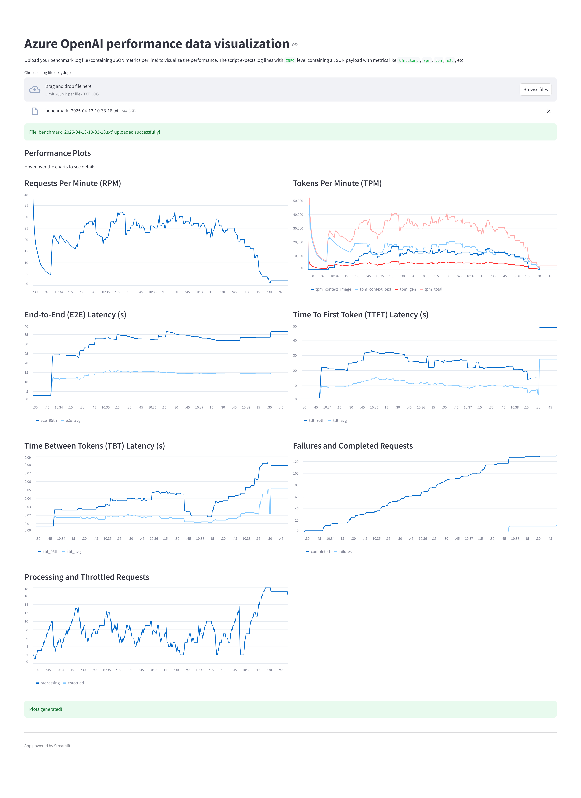

# Azure OpenAI Benchmark Tools

---

## 中文部分 (Chinese Section)

### 工具简介

*   **生成输入提示工具:** 此 Python 工具用于生成用于负载测试的 JSON 提示。支持结合文本和图像输入的多模态请求，同时也支持仅文本请求。
*   **性能数据可视化工具:** 此 Streamlit 应用程序用于可视化来自基准测试日志文件的性能指标。

---

### 环境准备 (适用于所有工具)

1.  **安装 Python**
    确保系统已安装 Python 3.10 或更高版本。

2.  **安装依赖包**
    推荐使用虚拟环境。使用以下步骤设置虚拟环境并安装所需的 Python 包：

    #### 创建虚拟环境
    ```bash
    python -m venv .venv
    ```

    #### 激活虚拟环境

    *   在 **Linux/macOS**:
        ```bash
        source .venv/bin/activate
        ```

    *   在 **Windows**:
        ```bash
        .venv\Scripts\activate
        ```

    #### 安装依赖包
    ```bash
    # 确保 pip 是最新版本
    python -m pip install --upgrade pip
    # 安装依赖包
    pip install pillow streamlit pandas
    ```

---

### 使用步骤 (适用于所有工具)

#### 步骤 1：克隆代码仓库
```bash
git clone https://github.com/guming3d/azure-openai-benchmark
cd azure-openai-benchmark
```
*注意：后续命令假定您克隆后位于项目的根目录 (`azure-openai-benchmark`)。*

#### 步骤 2：准备图片目录 (仅用于生成提示工具)

将需要使用的图片放入一个目录中（例如 `tools/images`）。支持 `.jpg`、`.jpeg` 和 `.png` 格式的图片。

---

### 使用说明：生成输入提示工具

运行以下命令以生成所需的提示（根据需要调整参数）：

```bash
python tools/generate_input_prompt.py --image-dir tools/images --request-ratio 0.5 --images-per-request 1 --output-file prompt-output-0.5.json --quality-mode high --total-messages 100
```

---

### 命令参数：生成输入提示工具

| 参数名称             | 参数描述                     |
|--------------------|-----------------------------|
| `--image-dir`      | 图片目录路径                 |
| `--request-ratio`  | 多模态请求比例（0.0 至 1.0）        |
| `--output-file`    | 输出文件路径                  |
| `--quality-mode`   | 图像质量模式：`low` 或 `high` (可选) |
| `--total-messages` | 生成消息的总数量 (可选)           |
| `--images-per-request` | 每个多模态请求包含的图片数量 (1-120, 可选，默认1) |

---

### 错误处理：生成输入提示工具

*   如果 `--request-ratio` 超出范围 (0.0 至 1.0)，脚本将抛出错误：
    ```
    Error: --request-ratio must be between 0.0 and 1.0 (inclusive).
    ```

*   如果图片目录中未找到任何图片，脚本将抛出错误：
    ```
    Error: No image files found in '<图片目录路径>'.
    ```

---

### 输出结果：生成输入提示工具

脚本将生成包含您所请求提示的 JSON 文件，保存到您通过 `--output-file` 参数指定的路径中。

---

### 使用说明：性能数据可视化工具

确保您位于 `azure-openai-benchmark` 项目的根目录，并且已经激活了虚拟环境。使用以下命令运行 Streamlit 应用：

```bash
streamlit run tools/visualize_streamlit.py
```

应用程序将在您的 Web 浏览器中打开，允许您上传包含性能指标的日志文件进行可视化。

### 可视化示例

以下是上传日志文件后的可视化界面示例：



---

### 联系方式 (通用 Contact)

如有任何问题或建议，请提交 [Issue](https://github.com/guming3d/azure-openai-benchmark/issues)。 

---

## English Section

### Tool Descriptions

*   **Generate Input Prompt Tool:** This Python tool generates JSON prompts for load testing. It supports multimodal requests combining text and image inputs, as well as text-only requests.
*   **Visualize Performance Data Tool:** This Streamlit application visualizes performance metrics from benchmark log files.

---

### Prerequisites (Applies to both tools)

1.  **Install Python**
    Ensure you have Python 3.10 or later installed on your system.

2.  **Install Required Packages**
    We recommend using a virtual environment. Use the steps below to set up a virtual environment and install the required Python packages:

    #### Create a Virtual Environment
    ```bash
    python -m venv .venv
    ```

    #### Activate the Virtual Environment

    *   On **Linux/macOS**:
        ```bash
        source .venv/bin/activate
        ```

    *   On **Windows**:
        ```bash
        .venv\Scripts\activate
        ```

    #### Install the Required Packages
    ```bash
    # Ensure pip is up-to-date
    python -m pip install --upgrade pip
    # Install packages
    pip install pillow streamlit pandas
    ```

---

### Setup (Applies to both tools)

#### Step 1: Clone the Repository
```bash
git clone https://github.com/guming3d/azure-openai-benchmark
cd azure-openai-benchmark
```
*Note: Subsequent commands assume you are in the root directory (`azure-openai-benchmark`) after cloning.*

#### Step 2: Prepare Image Directory (For Prompt Generation Tool Only)

Place the images you want to use in a directory (e.g., `tools/images`). Supported image formats are `.jpg`, `.jpeg`, and `.png`.

---

### Usage: Generate Input Prompt Tool

Run the script with the following command (adjust parameters as needed):

```bash
python tools/generate_input_prompt.py --image-dir tools/images --request-ratio 0.5 --images-per-request 3 --output-file prompt-output-0.5.json --quality-mode high --total-messages 100
```

---

### Command Arguments: Generate Input Prompt Tool

| Parameter          | Description                                                  |
|--------------------|--------------------------------------------------------------|
| `--image-dir`      | Path to the directory containing images                      |
| `--request-ratio`  | Ratio of multimodal requests (0.0 to 1.0)                    |
| `--output-file`    | Output file path                                             |
| `--quality-mode`   | Image quality mode: `low` or `high` (Optional)               |
| `--total-messages` | Total number of messages to generate (Optional)              |
| `--images-per-request` | Number of images to include in each multimodal request (1-120, Optional, default 1) |

---

### Error Handling: Generate Input Prompt Tool

*   If the `--request-ratio` is outside the range of 0.0 to 1.0, an error will be thrown:
    ```
    Error: --request-ratio must be between 0.0 and 1.0 (inclusive).
    ```

*   If no images are found in the image directory, an error will be thrown:
    ```
    Error: No image files found in '<image_dir>'.
    ```

---

### Output: Generate Input Prompt Tool

The script generates a JSON file containing the prompts you requested at the specified output file path.

---

### Usage: Visualize Performance Data Tool

Ensure you are in the root directory of the `azure-openai-benchmark` project where you activated your virtual environment. Run the Streamlit app using the following command:

```bash
streamlit run tools/visualize_streamlit.py
```

The application will open in your web browser, allowing you to upload a log file (containing performance metrics) for visualization.

### Example Visualization

Below is an example of the visualization interface after uploading a log file:


